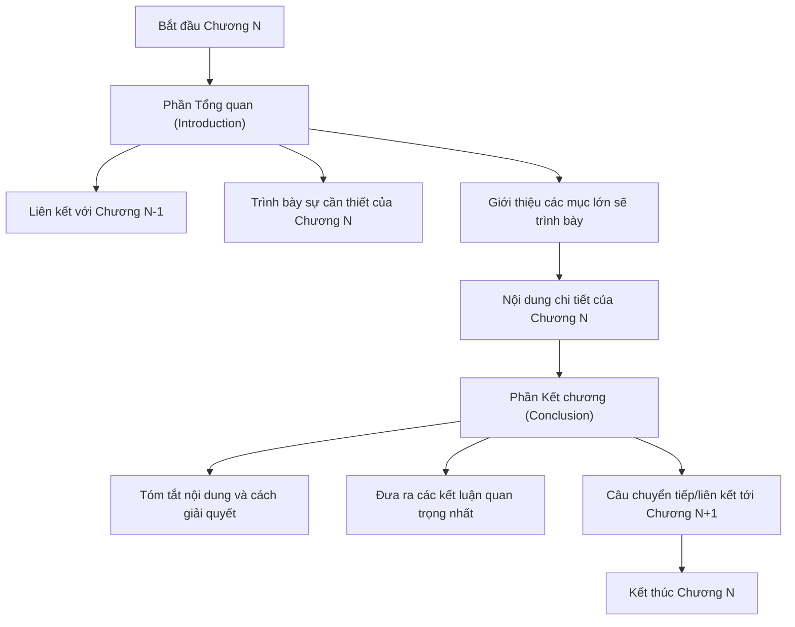
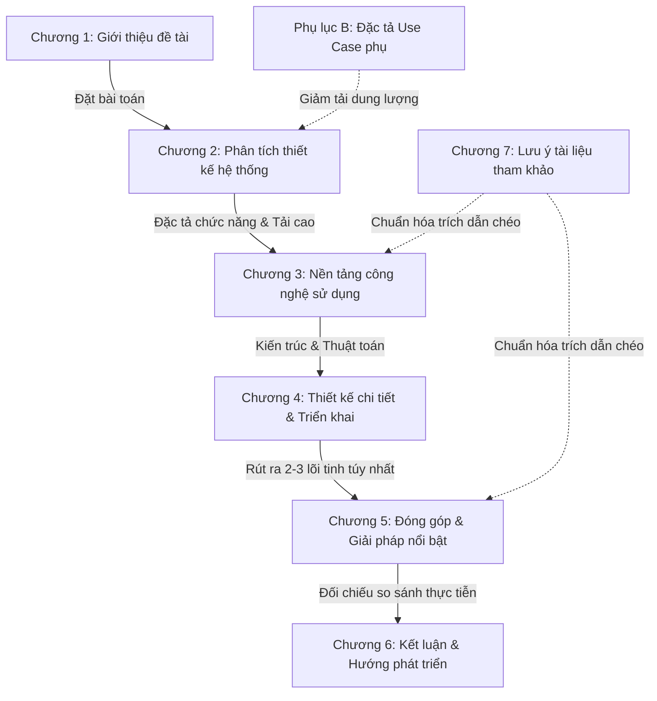

# HƯỚNG DẪN & QUY TẮC VIẾT ĐỒ ÁN TỐT NGHIỆP CHUẨN KHOA HỌC

Tài liệu này tổng hợp toàn bộ các quy định, hướng dẫn định dạng và quy tắc hành văn khoa học bắt buộc áp dụng khi viết báo cáo Đồ án tốt nghiệp (ĐATN) theo chuẩn báo cáo kỹ thuật kỹ sư/cử nhân (ISO 7144:1986).

---

## 1. QUY ĐỊNH CHUNG VỀ ĐỊNH DẠNG & TRÌNH BÀY

> [!IMPORTANT]
> Sinh viên cần đảm bảo tính thống nhất trên toàn bộ báo cáo từ phông chữ, khoảng cách dòng, căn lề lề hai bên, chú thích hình ảnh, bảng biểu đến định dạng margin trang.

### 📐 Cấu hình lề trang & In hai mặt (Margin & Twoside)
Trong file chính [DoAn.tex](file:///d:/Code/DATN/report/DoAn.tex), cấu hình chuẩn được thiết lập như sau:
*   **Kích thước chữ (Font Size)**: `13pt` chuẩn Times New Roman.
*   **Khoảng cách dòng (Line Spacing)**: `1.5 line` (`\onehalfspacing`).
*   **Khoảng cách đoạn (Paragraph Spacing)**: `6pt` (`\parskip{6pt}`).
*   **Thụt đầu dòng (Indentation)**: `15pt` (`\parindent{15pt}`).
*   **Cơ chế Lề trang hai mặt (`twoside`)**:
    *   **Lề trên / dưới**: $2.0$ cm.
    *   **Lề trong (Inner - left)**: $3.5$ cm (Dành cho gáy đóng quyển, bảo đảm chữ không bị đè).
    *   **Lề ngoài (Outer - right)**: $2.5$ cm.

### 📊 Bảng biểu, Hình vẽ & Công thức
*   **Nguyên tắc vàng**: Tất cả hình vẽ, bảng biểu, công thức, và tài liệu tham khảo trong ĐATN **nhất thiết phải được giải thích và tham chiếu chéo ít nhất một lần** trong nội dung văn bản (ví dụ: *``... như mô tả trong Hình \ref{fig:general_use_case}''*).
*   **Cấm kỵ**: Tuyệt đối không đưa hình vẽ hoặc bảng biểu vào báo cáo một cách tùy hứng mà không có lời dẫn dắt hoặc giải thích cụ thể bên dưới.

### 🔗 Tránh đạo văn
*   Tất cả các kiến thức, câu trích dẫn, sơ đồ hoặc số liệu không phải do sinh viên tự nghiên cứu/vẽ ra **bắt buộc phải được ghi rõ nguồn** bằng tham chiếu thư mục `\cite{...}` và đăng ký đầy đủ tại tệp dữ liệu tài liệu tham khảo [Danh_sach_tai_lieu_tham_khao.bib](file:///d:/Code/DATN/report/Danh_sach_tai_lieu_tham_khao.bib).

---

## 2. QUY TẮC HÀNH VĂN & VĂN PHONG KHOA HỌC (ACADEMIC TONE)

> [!WARNING]
> Báo cáo ĐATN là một tài liệu khoa học kỹ thuật nghiêm túc, không phải slide thuyết trình hay bài viết chia sẻ quan điểm cá nhân. Sinh viên cần đặc biệt lưu ý cách hành văn.

### ✍️ Cấu trúc đoạn văn
*   **Tính đơn ý**: Mỗi đoạn văn không được quá dài. Mỗi đoạn cần có ý tứ rõ ràng, bao gồm **duy nhất một ý chính** ở câu chủ đề và các câu phân tích bổ trợ để làm rõ hơn ý chính đó.
*   **Đầy đủ ngữ pháp**: Các câu văn trong đoạn phải đầy đủ chủ ngữ, vị ngữ.
*   **Tính liên kết**: Câu sau phải liên kết chặt chẽ với câu trước, đoạn sau liên kết logic với đoạn trước.
*   **Độ cô đọng**: Các câu văn cần được tối ưu hóa từ ngữ, bảo đảm rất khó để thêm hoặc bớt đi được dù chỉ một từ mà vẫn giữ nguyên ý nghĩa.

### 🚫 Các từ ngữ bị cấm tuyệt đối (Văn phong cảm xúc)
Tuyệt đối không sử dụng từ ngữ thuộc văn nói, các từ phóng đại, thái quá, hoặc các từ thiếu tính khách quan:

| ❌ Từ ngữ bị cấm (Văn nói / Cảm xúc) | ✔️ Giải pháp thay thế (Khách quan / Khoa học) |
|---|---|
| *Tuyệt vời*, *rất đỉnh*, *cực hay* | Đạt hiệu quả cao, tối ưu hóa tốt, vượt trội |
| *Cực kỳ hữu ích*, *siêu nhanh* | Đáp ứng tốt yêu cầu xử lý, cải thiện tốc độ phản hồi |
| *Theo tôi nghĩ*, *tôi thấy rằng* | Dựa trên kết quả thực nghiệm, dữ liệu cho thấy |
| *Hoàn hảo không vết xước*, *100% không lỗi* | Đạt độ tin cậy cao, triệt tiêu tối đa rủi ro phát sinh |

---

## 3. CẤU TRÚC BẮT BUỘC CỦA MỖI CHƯƠNG (TỔNG QUAN & KẾT CHƯƠNG)

Mỗi chương trong báo cáo bắt buộc phải tuân thủ cấu trúc đóng - mở mạch lạc bằng hai phần: **Tổng quan** và **Kết chương** với định dạng văn bản bình thường (Normal), không in đậm/in nghiêng, không đóng khung.

### 🔹 Phần Tổng quan (Đầu chương)
*   **Mục tiêu**: Tạo sự liên kết logic với chương đứng trước.
*   **Nội dung**:
    1.  Liên kết ngắn gọn với Chương $N-1$.
    2.  Trình bày lý do xuất hiện và sự cần thiết của Chương $N$ trong tổng thể đồ án.
    3.  Giới thiệu khái quát các vấn đề sẽ trình bày trong chương kèm theo các số hiệu mục lớn tương ứng.

### 🔸 Phần Kết chương (Cuối chương)
*   **Mục tiêu**: Đóng lại các vấn đề đã mở ra ở phần Tổng quan.
*   **Nội dung**:
    1.  Đưa ra một số kết luận kỹ thuật/khoa học quan trọng nhất của chương.
    2.  Tóm tắt lại kết quả đạt được và cách giải quyết các bài toán trong chương.
    3.  **Bắt buộc**: Có một câu chuyển tiếp liên kết chặt chẽ tới chương tiếp theo (Chương $N+1$).
    4.  *Chú ý*: Không viết nội dung phần Kết chương trùng lặp hoàn toàn với phần Tổng quan.

---

## 4. HƯỚNG DẪN TRÌNH BÀY CHI TIẾT CHƯƠNG 1 (GIỚI THIỆU)

Chương 1 có độ dài tiêu chuẩn từ **3 đến 6 trang** và cấu trúc bắt buộc như sau:

### 📥 1. Đặt vấn đề
*   **Nội dung**: Làm nổi bật mức độ cấp thiết, tầm quan trọng hoặc quy mô của bài toán thực tế cần giải quyết.
*   **Gợi ý cấu trúc**: Xuất phát từ tình hình thực tế $\rightarrow$ dẫn đến vấn đề hoặc bài toán phát sinh $\rightarrow$ lợi ích mang lại cho xã hội/doanh nghiệp khi vấn đề được giải quyết.
*   **Quy định nghiêm ngặt**: Chỉ trình bày vấn đề thực tế, **tuyệt đối không trình bày giải pháp kỹ thuật** ở phần này.

### 📥 2. Mục tiêu và phạm vi đề tài
*   **Nội dung**:
    1.  Trình bày tổng quan kết quả nghiên cứu hiện có hoặc các sản phẩm thương mại hiện có trên thị trường.
    2.  Tiến hành so sánh, đánh giá tổng quan ưu/nhược điểm của các giải pháp hiện tại.
    3.  Khái quát lại các hạn chế đang gặp phải $\rightarrow$ xác định nhiệm vụ cụ thể đồ án hướng tới giải quyết để khắc phục hạn chế đó.
*   **Quy định nghiêm ngặt**: Chỉ trình bày tổng quan mức cao, **không đi sâu vào chi tiết** giải pháp kỹ thuật.

### 📥 3. Định hướng giải pháp
*   **Nội dung**: Trình bày định hướng giải quyết theo trình tự:
    1.  Giải quyết bằng định hướng/công nghệ/thuật toán/kỹ thuật cụ thể nào.
    2.  Mô tả cực kỳ ngắn gọn giải pháp tổng quan của đồ án khi đi theo định hướng đó.
    3.  Nêu rõ đóng góp chính của đồ án và kết quả kỳ vọng đạt được.
*   **Quy định**: Không phân tích hay giải thích chi tiết thuật toán/công nghệ ở đây (phần chi tiết dành cho Chương 3 và Chương 4). Chỉ mô tả ngắn gọn từ 1 đến 2 câu và giải thích nhanh lý do lựa chọn.

### 📥 4. Bố cục đồ án
*   **Quy định nghiêm ngặt**: Viết hoàn toàn dưới dạng **các đoạn văn đầy đủ**, mô tả logic và liên kết. **Tuyệt đối cấm gạch ý hoặc dùng bullet đầu dòng** trong phần này.
*   *Lưu ý*: Chỉ mô tả từ Chương 2 trở đi, không cần tự mô tả lại Chương 1.

---

## 5. QUY TẮC LIỆT KÊ & SỬ DỤNG BULLET TRONG BÁO CÁO

*   **Hạn chế lạm dụng gạch đầu dòng**: Việc sử dụng quá nhiều gạch đầu dòng làm giảm tính liên kết của bài viết khoa học. Khi cần liệt kê, ưu tiên sử dụng phong cách viết La Mã lồng ghép trực tiếp vào câu văn dạng:
    > *``nhiều sinh viên luôn cảm thấy hối hận vì (i) chưa cố gắng hết mình, (ii) chưa sắp xếp thời gian học/chơi hợp lý...''*
*   **Thống nhất Style cho Bullet**: Trong trường hợp bắt buộc phải sử dụng các gạch đầu dòng liệt kê, sinh viên phải bảo đảm **thống nhất tuyệt đối** style bullet trên toàn báo cáo:
    *   Nếu bullet cấp 1 sử dụng hình tròn đen (`\bullet`), toàn bộ báo cáo từ Chương 1 đến Phụ lục đều phải sử dụng hình tròn đen cho cấp 1.
    *   Nên sử dụng môi trường `itemize` chuẩn của $\text{\LaTeX}$ để tự động hóa căn lề thụt dòng đều đặn, không tự ý gõ dấu gạch ngang `-` hoặc dấu sao `*` thô ở đầu dòng văn bản.

---

## 6. BẢN ĐỒ TỔNG QUAN CÁC CHƯƠNG & MỤC ĐÍCH CỦA QUYỂN ĐỒ ÁN

Bảng phân tích dưới đây khái quát hóa mục tiêu kỹ thuật, vai trò học thuật và liên kết logic của từng chương trong toàn bộ quyển ĐATN giúp sinh viên nắm vững lộ trình triển khai:

### 📑 Chi tiết mục đích và nhiệm vụ của từng chương

#### 1. Chương 1: Giới thiệu đề tài (Mở đầu)
*   **Mục đích**: Thiết lập bối cảnh thực tiễn và tính cấp thiết khoa học của đề tài. Nhấn mạnh vào ba thách thức cốt lõi: tranh chấp kho tải cao (Overselling), bảo mật xác thực (Refresh Token Rotation), và cá nhân hóa trải nghiệm khách hàng.
*   **Nhiệm vụ cốt lõi**: Đặt vấn đề thực tế (không đưa giải pháp), nêu rõ mục tiêu và phạm vi giới hạn của đề tài, phác thảo định hướng công nghệ tổng quan và bố cục mạch lạc của báo cáo.

#### 2. Chương 2: Phân tích và Thiết kế hệ thống (Ranh giới chức năng)
*   **Mục đích**: Đặc tả chi tiết các tác nhân (Khách hàng, Vendor, Platform Admin) cùng các biểu đồ ca sử dụng (Use Case) để phân rã chức năng.
*   **Nhiệm vụ cốt lõi**: Khảo sát hiện trạng (so sánh với Shopify, Woocommerce); xây dựng quy trình nghiệp vụ mua bán giữ kho kết hợp thanh toán đồng thời (Activity Diagram & Sequence Diagram); đặc tả chi tiết 4 Use Case cốt lõi (Auth, Place Order, Apply Vouchers, Merchant Stats); thiết lập yêu cầu phi chức năng (tốc độ API < 200ms, độ lệch tồn kho 0%, rate-limit).

#### 3. Chương 3: Nền tảng lý thuyết và Công nghệ sử dụng (Cơ sở khoa học)
*   **Mục đích**: Giải thích, phân tích và chứng minh lý do lựa chọn bộ công nghệ (MERN Stack, Redis cache, Socket.IO, Stripe/VNPay, Hybrid Recommendation Engine) để giải quyết các yêu cầu đặt ra ở Chương 2.
*   **Nhiệm vụ cốt lõi**: Với mỗi công nghệ/lý thuyết được trình bày, sinh viên phải so sánh đối chiếu chi tiết với **giải pháp thay thế tương đương** và chứng minh sự vượt trội của lựa chọn hiện tại dựa trên các chỉ số khoa học thực tế.

#### 4. Chương 4: Phân tích thiết kế, Triển khai và Đánh giá hệ thống (Thiết kế chi tiết)
*   **Mục đích**: Hiện thực hóa kiến trúc phần mềm từ mức khái niệm sang mức thiết kế cấu trúc chi tiết và vật lý của hệ thống.
*   **Nhiệm vụ cốt lõi**: Vẽ biểu đồ thiết kế gói UML (UML Package Diagram) phân lớp rõ ràng; thiết kế sơ đồ lớp chi tiết và luồng truyền thông điệp; thiết kế sơ đồ thực thể liên kết (E-R Diagram) / lược đồ MongoDB tài liệu lồng nhau; liệt kê thư viện, công cụ lập trình kèm phiên bản cụ thể; thiết kế kịch bản kiểm thử (Test Cases) và triển khai server/thiết bị thực tế.

#### 5. Chương 5: Các giải pháp và đóng góp nổi bật (Trọng tâm học thuật)
*   **Mục đích**: Là nơi sinh viên thể hiện sự tâm đắc, sáng tạo và lập luận khoa học để giải quyết các bài toán khó nhất của đồ án. Đây là cơ sở then chốt để thầy cô đánh giá điểm số.
*   **Nhiệm vụ cốt lõi**: Trình bày độc lập từ 2 đến 3 đóng góp lớn nhất (ví dụ: *Thuật toán giữ kho nguyên tử ngăn chặn oversell dưới tải cao*, *Động cơ tính giảm giá bảo mật 4 lớp*, hoặc *Lớp đệm bảo mật rate-limit bằng Redis*). Mỗi đóng góp phải viết đủ 3 phần con: (i) dẫn dắt bài toán khó, (ii) giải pháp chi tiết của bản thân, và (iii) kết quả thực nghiệm đạt được.

#### 6. Chương 6: Kết luận và Hướng phát triển (Tổng kết và Mở rộng)
*   **Mục đích**: Tổng kết và đánh giá công bằng kết quả đạt được sau toàn bộ quá trình nghiên cứu, thực hiện đồ án.
*   **Nhiệm vụ cốt lõi**: So sánh sản phẩm/kết quả thực tế của mình với các sản phẩm tương tự trên thị trường; phân tích rõ những gì đã làm được và những gì còn hạn chế; đúc kết bài học kinh nghiệm; đề ra định hướng công việc và hướng đi mới trong tương lai để nâng cấp/cải thiện sản phẩm.

#### 7. Chương 7: Một số lưu ý về tài liệu tham khảo (Quy chuẩn trích dẫn)
*   **Mục đích**: Hướng dẫn và chuẩn hóa cách thức liệt kê thông tin tài liệu tham khảo.
*   **Nhiệm vụ cốt lõi**: Phân loại và khai báo chuẩn hóa 5 nguồn tài liệu chính (Bài báo tạp chí khoa học, Sách, Tập san báo cáo hội nghị, Đồ án/luận văn tốt nghiệp, Tài liệu Internet chính thống). **Tuyệt đối cấm** đưa bài giảng/slide, Wikipedia hoặc các blog cá nhân trôi nổi làm tài liệu tham khảo.

#### 8. Các Phụ lục (Supplementary Information)
*   **Phụ lục A (Hướng dẫn viết ĐATN)**: Chứa các quy định chi tiết về cách định dạng tài liệu, cài đặt công cụ.
*   **Phụ lục B (Đặc tả Use Case bổ sung)**: Chứa thông tin đặc tả chi tiết của các Use Case phụ nhằm giảm dung lượng, giúp nội dung Chương 2 tập trung sâu sắc vào các Use Case cốt lõi nhạy cảm của hệ thống.

